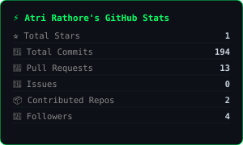
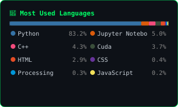

 

  

---

## 👋 About Me

I'm a **Computer Science student at Chandigarh University**, specializing in **AI, Machine Learning & Computer Vision**. I build intelligent systems that bridge research and real-world impact — from autonomous drones to medical diagnostics to serverless AI agents.

- 🔭 Currently scaling **RoboCop** & **G.U.A.R.D.** to production
- 🤖 Built **DODO** — my custom AI assistant, live on my portfolio
- 📑 **8+ Patents** filed with Govt. of India — 4+ approved
- 🏆 Won **1st place** at Ctrl+Alt+Hack 2025 (NSUT Delhi, 250+ teams)
- 🌱 Deep in **LangGraph · RAG · Agentic AI** architectures
- 📬 Reach me at **rathoreatri03@gmail.com**

---

## ⚙️ Tech Stack

**🧠 AI · ML · Computer Vision**

**🏗️ AI Architecture · DevOps · Hardware**

**🌐 Web · Cloud · Tools**

---

## 🚀 Featured Projects

| Project | Description | Stack | Link |
|---|---|---|---|
| 🌕 **AstroTerra** | Lunar boulder detection for safe landing site selection | `PyTorch` `CV` `Space AI` |  |
| 🛡️ **G.U.A.R.D** | Real-time accident detection & emergency response ecosystem | `YOLOv8` `Sensor Fusion` `IoT` |  |
| 🕶️ **O.C.G** | Hands-free object control via eye-tracking & gestures | `MediaPipe` `Arduino` `CV` |  |
| 🚁 **RoboCop** | Autonomous highway surveillance drone platform | `Avionics` `Edge AI` `GPS` |  |
| 🧬 **Murphy Systum** | Multi-disease AI diagnostics (brain tumor + cancer) | `Deep Learning` `Medical AI` |  |
| 💊 **LifeMatrix** | Hospital patient vitals monitoring with AI triage | `Biosensors` `Healthcare AI` | — |

---

## 🏆 Achievements

| 🥇 | Event | Result |
|---|---|---|
| 🏆 | **Ctrl+Alt+Hack 2025 — NSUT Delhi** | 🥇 1st Place · 250+ teams |
| 🎯 | **INNOV8 — Jaipur** | Top 5 Finalist · 700+ teams |
| 🏅 | **VIHAAN 007** | Best IEEE Award (G.U.A.R.D) |
| 🔟 | **Code Wizard 2025 — SRM Delhi** | Top 10 · 400+ teams |
| 🥈 | **HIS 2.0 — Rajasthan** | 5th Rank · RoboCop |
| 🌿 | **Think'N'Green 2024** | Grand Winner · Mycofibre |
| 🌱 | **Bihar Innovation Challenge 2024** | Top 25 Teams |
| ⚡ | **VIHAAN 6.0** | Best Freshers Award · 400+ teams |

---

## 📊 GitHub Stats

<!-- Streak — demolab is self-contained and reliable -->

  

<!-- Activity graph — vercel-hosted, generally reliable -->

 

<!-- Stats cards — auto-generated by GitHub Action into this repo (always loads) -->

&nbsp;

  

> ⚙️ `github-stats.svg` and `github-langs.svg` are auto-generated by the GitHub Action below and committed directly to this repo — no external service, always loads.

---

## 📑 Research & IP

- 📖 **Book Chapter** — *Printing a Sustainable Future*, CRC Press 2023 · [Read →](https://www.taylorfrancis.com/chapters/edit/10.1201/9781003406488-8/printing-sustainable-future-jagdeep-kaur-atri-rathore-tarveen-kaur-prabal-batra)
- 🔬 **Patent #202311054420** — Organic 3D Filament from food waste ✅ Approved
- 🍄 **Patent #202311048967** — Mycofibre Composite biodegradable textile ✅ Approved
- 🛡️ **Patent #202311054397** — AI-Enabled Tracking Security System ✅ Approved
- 📝 **5+ Research Papers** in international journals

---

